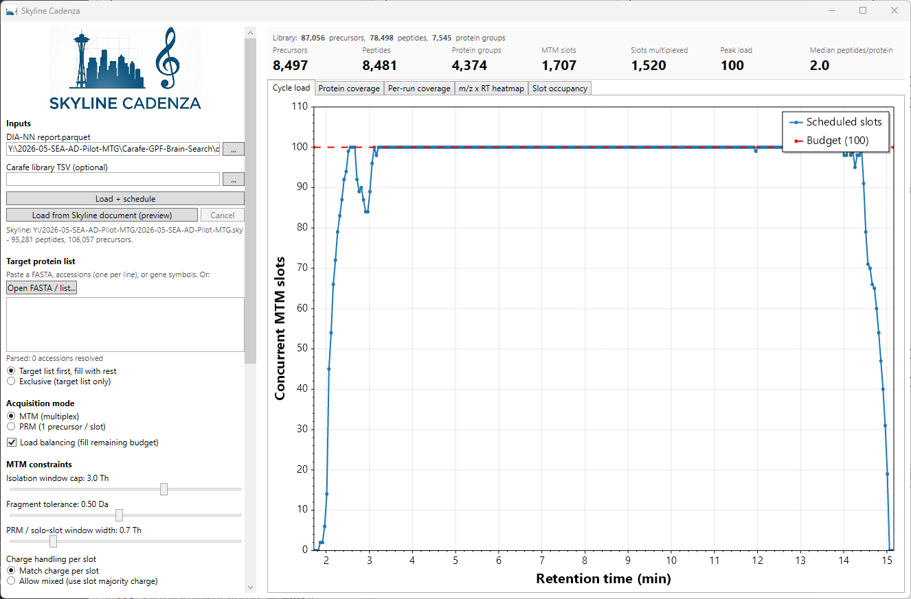
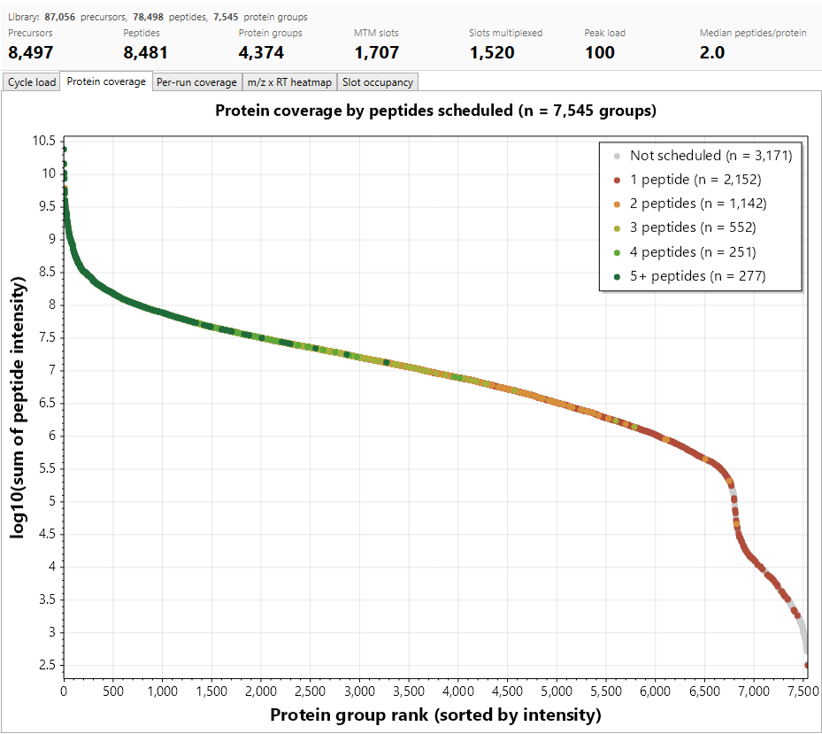
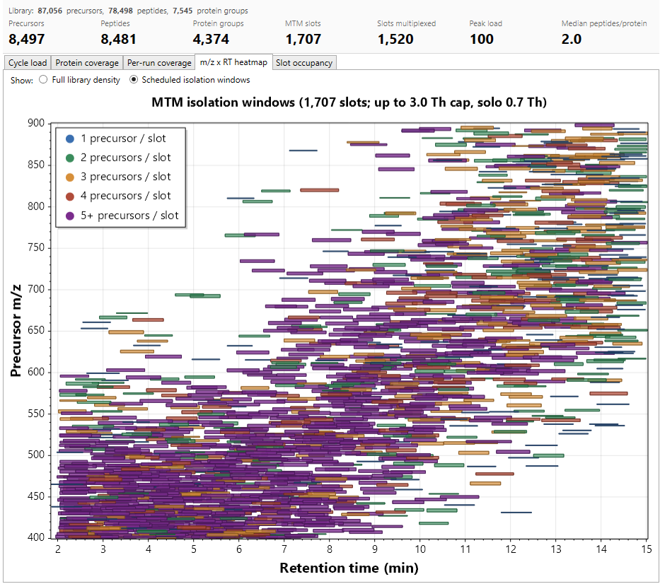

<p align="center">
  
</p>

# Skyline Cadenza

A Skyline external tool for designing **load-balanced PRM / MTM targeted assays** from gas-phase-fractionated DIA-NN libraries or Carafe AI-predicted spectral libraries.

Given a DIA-NN `report.parquet` (single-run, GPF, or quantitative experiment) *or* a Carafe library plus a target protein list, Cadenza builds a candidate pool, applies protein parsimony, and selects a peptide target list that **maximizes the number of parsimonious proteins covered** under a configurable concurrent-MS/MS-slot budget. Multiplexed Multiple Target Monitoring (MTM) slot-sharing follows the scheme in US 11,688,595 B2 (Remes & MacCoss, 2023): two co-eluting precursors that fit in a 2-3 Th isolation window share one acquisition slot when their top-4 predicted fragments do not overlap.

The tool exposes a live-update WPF UI with every parameter bound to a slider or radio button, recomputes the schedule in the background on each change, and writes results back to the active Skyline document **or** to a Thermo Method Editor-importable inclusion CSV.

Analogous to Thermo's PRM-Conductor but focused on the MacCoss lab's MTM work; descended from the prototype notebook at [`maccoss/targeted-modeling`](https://github.com/maccoss/targeted-modeling) (`gpf_coverage.ipynb`).

## What it looks like

Cadenza loads on the left, with every scheduling knob bound to a live control. Plots are tabbed on the right; the **summary strip** along the top of the plot area tracks library counts vs. scheduled counts in real time:

<p align="center">
  
</p>

> Library 87,056 precursors / 78,498 peptides / 7,545 protein groups (SEA-AD MTG GPF), scheduled to 8,497 precursors / 8,481 peptides / 4,374 protein groups across 1,707 MTM slots (1,520 multiplexed). Peak concurrent load = 100 (the budget line in the Cycle load plot). Median peptides per kept protein = 2.0.

## What it produces

Each protein group is plotted by `log10(summed precursor intensity)` against rank and colored by the number of peptides the scheduler kept for it. High-intensity groups fill the scheduler easily (deep green = 5+ peptides each); low-intensity groups drop out (red / grey tail) when the cycle budget can't fit more. With a 100-slot budget across the SEA-AD MTG library, 4,374 / 7,545 protein groups are covered by at least one peptide and 3,171 are dropped:

<p align="center">
  
</p>

The **m/z × RT heatmap** in scheduled mode draws every MTM slot as a polygon whose width = max(member m/z spread, PRM window cap) and height = padded firing window. Color encodes multiplex depth: blue = 1 precursor / slot (solo), through purple = 5+. This view is the fastest way to see whether the scheduler is multiplexing aggressively across the gradient or wasting slots on singletons:

<p align="center">
  
</p>

> 1,707 total slots, 3.0 Th cap, 0.7 Th solo width. Most slots are 2- or 3-precursor MTM (orange / yellow); the dense diagonal band reflects the elution-time vs. m/z correlation typical of tryptic libraries.

## Installation

1. Build the zip from source (see *Development* below) — output is `publish/SkylineCadenza.zip`.
2. In Skyline-daily: `Tools > External Tools > Add > File...` and pick `SkylineCadenza.zip`.
3. The tool appears as `Skyline Cadenza...` in the Tools menu.

Requires **Skyline-daily 26.1.1.083 or later** and the **.NET 8 Desktop Runtime** on Windows.

## Quick start — DIA-NN flow

1. Launch via `Tools > Skyline Cadenza...`. The Skyline-status line should immediately show your current document and counts.
2. **Inputs panel** (left side):
   - **DIA-NN report.parquet**: e.g. `Y:\2026-05-SEA-AD-Pilot-MTG\Carafe-GPF-Brain-Search\diann_project\report.parquet`.
   - **Carafe library TSV** *(optional)*: if absent, Cadenza falls back to the fragment columns DIA-NN already wrote (`Fr.0.Id`..`Fr.11.Id`) — real measured m/z, not synthetic.
3. Click **Load + schedule**. The progress bar runs and the status line tells you which stage is in flight (read → parsimony → fragments → candidates → scheduler).
4. Tune the parameters live (sliders / radio buttons in the left panel). The scheduler reruns automatically — usually in well under a second after each nudge — and the four plot tabs redraw.
5. When you're happy with the schedule:
   - **Push targets to Skyline** writes a peptide-style transition list to a temp CSV and runs `SkylineCmd --import-transition-list=<path>` on the live document. Imported entries appear in the protein/peptide tree.
   - **Export Thermo CSV...** writes a Thermo Method Editor-importable scheduled inclusion list. Open your template `.meth` in Method Editor and choose `Import Scheduled List`.

## Carafe-only mode (no DIA-NN report)

Leave the report path blank and instead provide:

- A **Carafe library TSV** (`carafe_spectral_library.tsv` or similar).
- A **target protein list** — paste a FASTA, accessions, or gene symbols into the text box, or click *Open FASTA / list...*.

Cadenza streams the Carafe TSV (~13 s for the 2.6 GB reference library on NVMe), filters to the target proteins by `ProteinID`, computes parsimony from the Carafe peptide-protein associations, and synthesizes peak boundaries from `Tr_recalibrated` ± 0.1 min (configurable). Predicted-intensity ranking uses the sum of the top-4 fragment `RelativeIntensity` values.

## Parameter reference

All knobs are in the left panel and bound to live sliders / radio buttons. Defaults match the validated configuration of the notebook prototype.

### Target protein list
- Paste a FASTA, newline-separated accessions, or gene symbols, or *Open FASTA / list...* a file.
- **Target list first, fill with rest** (default): the scheduler covers your target proteins first, then fills remaining budget with off-list proteins ranked by intensity.
- **Exclusive (target list only)**: ignores off-list proteins entirely.

### Acquisition mode
- **MTM (multiplex)** — default. Co-eluting precursors share isolation windows when fragments allow.
- **PRM (1 precursor / slot)** — solo windows only.
- **Load balancing** — once every protein group has at least one peptide scheduled, fill remaining budget with extra peptides per protein, capped by *Max peptides per protein*.

### MTM constraints
- **Isolation window cap (Th)** — default 3.0; max width allowed when joining an MTM slot.
- **Fragment tolerance (Da)** — default 0.5; precursors with any top-4 fragment within this tolerance won't multiplex.
- **PRM / solo-slot window width (Th)** — default 0.7; also the minimum width drawn for solo MTM slots.
- **Charge handling per slot**:
  - *Match charge per slot* (default): an MTM slot can only contain precursors of identical charge.
  - *Allow mixed (use slot majority charge)*: lets different charges co-multiplex; the Thermo CSV reports the slot's majority charge.

### Cycle budget
- **Concurrent slots** — default 100. Maximum simultaneous acquisition slots per cycle.
- **RT buffer (each side)** — default 15 s. Padding added on each side of every peak's `RT.Start`/`RT.Stop`. The slot's firing window = padded union of its members.

### Per-protein peptide bounds
- **Min peptides per protein** — default 1. Enforced post-filter; protein groups failing the min are dropped from the schedule entirely (their slots are freed too, so the cycle-load curve reflects only kept slots).
- **Max peptides per protein** — default 5.

### Ranking
- **Protein ranking**: `SummedIntensity` (default), `ProteinQValue`, `ProvidedListOrder`.
- **Peptide ranking**: `PrecursorQuantity` (default), `QValue`.

### Library filter
- **Q value cutoff** — default 0.01. Applied at ingest before parsimony.

### Output knobs
- **Normalized CE** — default 28.0. Only written into the Thermo CSV; doesn't affect scheduling.

## Plot tabs

| Tab | Library view shows | Scheduled view shows |
| --- | --- | --- |
| **Cycle load** | Concurrent MTM acquisition slots vs. retention time, with budget line. | (n/a — single view) |
| **Protein coverage** | Per-protein bar of `log10(summed precursor intensity)`, sorted high → low, colored by *peptides scheduled* per protein (grey = 0, red = 1, ..., dark green = 5+). | (single view) |
| **Per-run coverage** | Coverage curves per DIA-NN run. If runs match the `Chrlib400-500` GPF pattern, one curve per GPF + dashed black sum. Otherwise one curve labeled with the run name. | (single view) |
| **m/z × RT heatmap** | Binned precursor density across the loaded library. | Each slot rendered as a rectangle: width = max(member m/z spread, PRM window), height = padded firing window. Color by member count (PRM = solid blue; MTM = blue/green/orange/red/purple for 1/2/3/4/5+). |
| **Slot occupancy** | (n/a) | Bar chart of % of slots holding 1, 2, 3, 4, 5+ precursors. |

## Outputs

### Push targets to Skyline

The **Push targets to Skyline** button writes a peptide-style transition list to a temp CSV and runs `SkylineCmd --import-transition-list=<path>` against the live document. Each scheduled precursor emits one row per top-4 fragment with columns:

```
Protein Name, Peptide Modified Sequence, Precursor Charge, Precursor m/z, Product m/z, Product Charge, Explicit Retention Time, Explicit Retention Time Window, Note
```

The `Note` column carries `slot=<id>;type=<unique|razor>` so MTM grouping is visible inside Skyline. DIA-NN's `C(UniMod:4)` and Carafe's `_C[UniMod:4]_` modified-sequence syntaxes are both normalised to Skyline's preferred `C[UniMod:4]` (brackets, no underscores) before insertion. Skyline's Immediate-Window response is echoed into the status text so import errors come back as readable text.

### Export Thermo CSV

The **Export Thermo CSV...** button writes a scheduled inclusion list. Columns:

```
Compound, Formula, Adduct, m/z, z, t (min), Window (min), Isolation Window (m/z), Normalized CE
```

For **PRM** mode: one row per scheduled precursor. For **MTM** mode: **one row per slot** — multiplexed slots join member peptide names in the `Compound` column with ` | ` separators, report the slot's center m/z, the majority charge in `z`, the co-elution midpoint in `t (min)`, the full padded firing window in `Window (min)`, and `max(member spread, PRM width)` in `Isolation Window (m/z)`.

Import the CSV into a template `.meth` via Thermo Method Editor → `Import Scheduled List`.

## Architecture

```
src/
  SkylineCadenza.App/      WPF UI (net8.0-windows). The .exe Skyline launches.
  SkylineCadenza.Core/     Pure algorithms + I/O + RPC client (net8.0-windows).
  SkylineCadenza.Tests/    xUnit (21 tests today).
external/SkylineTool/      Vendored copies of pwiz's JSON-RPC client sources
                           (link-compiled into Core; Apache 2.0).
docs/screenshots/          Documentation images.
build/                     MSBuild packaging target -> SkylineCadenza.zip.
tools/                     Dev helpers (install-dev.ps1).
```

Highlights:
- **Parsimony**: streamlined port of `skyline_prism.parsimony` (inverted-index subsumption + single-pass razor assignment). ~70× faster than the reference on the test dataset and byte-for-byte equivalent on the validated fixtures.
- **Scheduler**: greedy two-pass (cover → load-up), strict intersection-based co-elution (no chain extension across non-overlapping peptides), explicit MTM slot model.
- **Ingest**: `Parquet.Net` for DIA-NN parquet; hand-rolled streaming TSV reader for the 2.6 GB Carafe library (~13 s end-to-end).
- **Skyline RPC**: connect-per-call against the JSON-RPC pipe (`SkylineMcpJson-` prefix) Skyline's `JsonToolServer` exposes — same pattern the upstream `SkylineMcpServer` uses.
- **Plots**: ScottPlot 5 WPF.

## Development

Requires .NET 8 SDK on Windows or WSL (cross-compile is enabled in `Directory.Build.props`).

```bash
git clone https://github.com/maccoss/skyline-cadenza.git
cd skyline-cadenza
dotnet restore
dotnet build SkylineCadenza.sln
dotnet test
dotnet msbuild build/package.proj    # produces publish/SkylineCadenza.zip
```

For local smoke testing without going through the zip+install cycle, run `tools/install-dev.ps1` from Windows — it publishes the App and copies the output into `%LOCALAPPDATA%\Apps\SkylineDaily\Tools\SkylineCadenza\`. Restart Skyline-daily afterwards.

## Status

| Area | Status |
| --- | --- |
| DIA-NN report ingest | ✅ stable; tested on 87k-precursor MTG dataset |
| Carafe TSV ingest | ✅ stable; 2.6 GB file in ~13 s |
| Carafe-only mode (target list + Carafe) | ✅ working |
| Parsimony engine | ✅ stable; 21 unit tests |
| Scheduler (PRM + MTM) | ✅ stable; matches notebook prototype |
| Live UI + plots | ✅ working |
| Thermo CSV export | ✅ working |
| Skyline auto-connect on launch | ✅ working |
| Push targets to Skyline (peptide import) | ✅ writes a self-contained `.blib` and registers it as a Skyline library; final peptide-add via Library Explorer is currently manual |
| Load library from running Skyline document | ✅ working; reads per-peptide BLIB peak boundaries for the firing window, falls back to synthesised `RT ± 18 s` only when no BLIB covers the peptide |
| Per-GPF heatmap panels | ⏳ single combined heatmap today; per-GPF stacked panels still pending |

## References

- Heil L. et al., *Closing the gap between targeted and untargeted measurements using intelligent data acquisition on Stellar MS*, ASMS 2025.
- Remes P.R. & MacCoss M.J., US 11,688,595 B2, *Mass spectrometry methods*, 2023.
- Stellar MS Webinar 2024, *Balancing the Load: maximizing instrument time and performance characteristic to increase targeted data quality*.
- ProteoWizard pwiz: <https://github.com/ProteoWizard/pwiz>.
- Prototype notebook: <https://github.com/maccoss/targeted-modeling> (`gpf_coverage.ipynb`).

## License

Apache 2.0. See `LICENSE`.
