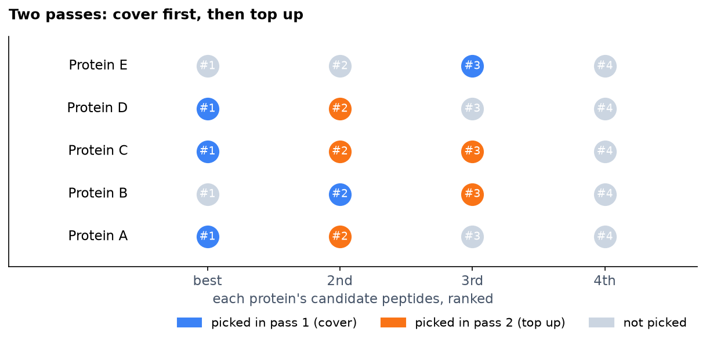
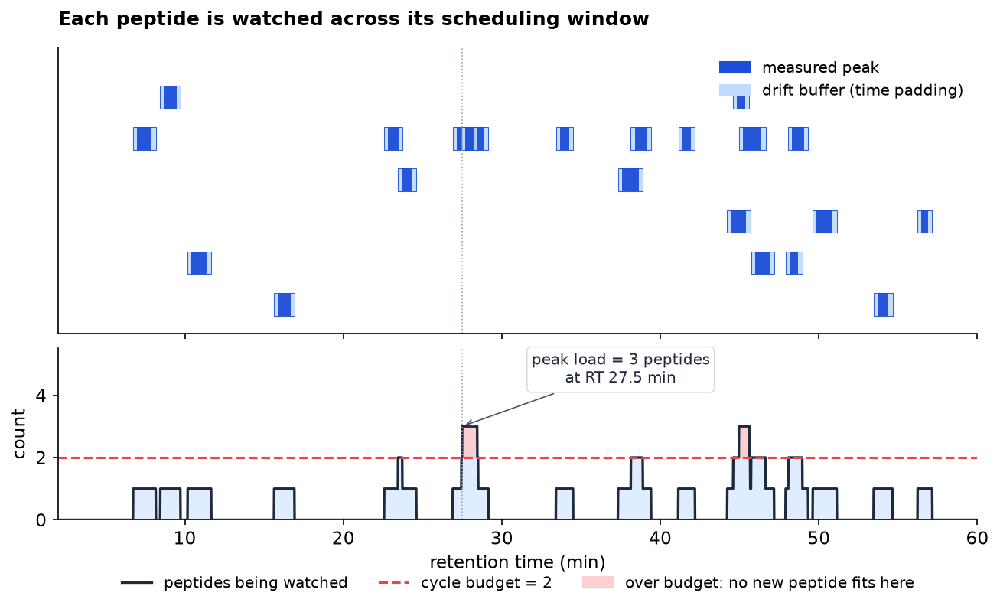
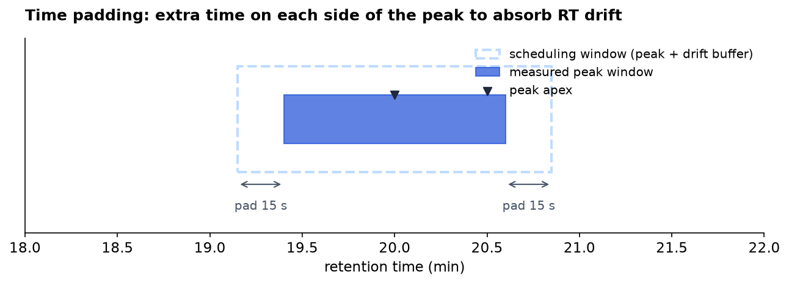
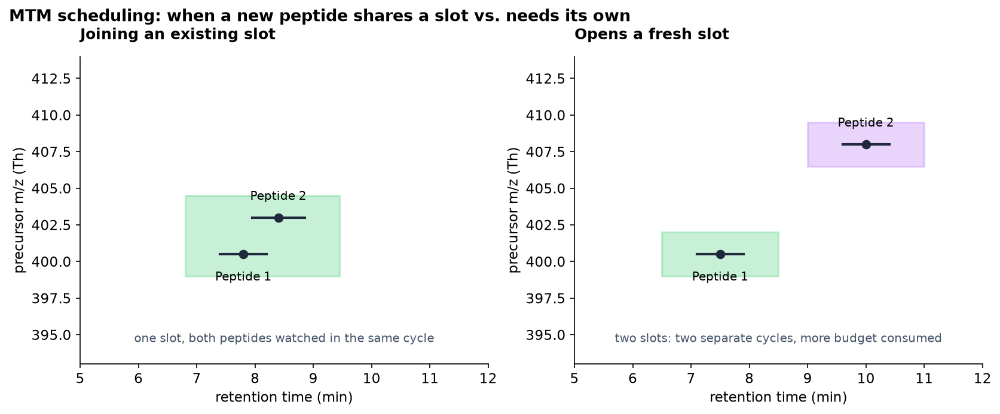
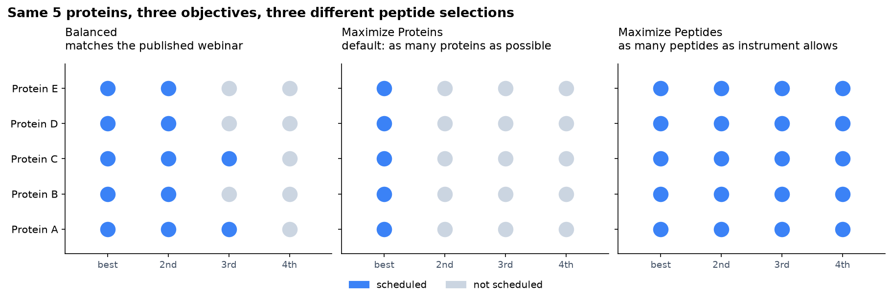

# Coverage objectives

A targeted PRM or MTM assay only has so much instrument time. At any
moment along the LC gradient the mass spectrometer can watch a fixed
number of peptides at once (the **cycle budget**), so when a lot of
peptides happen to elute at the same retention time, the scheduler has
to leave some of them out.

The "coverage objective" knob is how you tell Cadenza what to leave out
when there isn't room for everything. There are three choices:

- **Balanced**: the published Stellar webinar algorithm, kept as a
  reproducible baseline.
- **Maximize Proteins** (default): get at least one peptide for as
  many proteins as possible.
- **Maximize Peptides**: get as many peptides as the instrument can
  watch, even if a few proteins dominate.

This page explains what each choice does, with figures. For the
individual knobs (cycle budget, isolation width, charge handling,
etc.) see [`settings.md`](settings.md); for what the scheduler reads
from and writes to Skyline see [`skyline-integration.md`](skyline-integration.md).

## How scheduling works in two passes

Every objective goes through the same two passes:

1. **Pass 1 (cover)**: walk through every protein once and try to
   schedule one peptide for it. Smallest proteins first, because they
   have the fewest fallback options.
2. **Pass 2 (top up)**: walk back through the proteins that got a
   peptide, and try to add another. Repeat until a full lap adds
   nothing.

What changes between objectives is (a) **which** peptide pass 1 picks,
and (b) **how many** peptides pass 2 is allowed to add per protein.

In the figure above, the blue circles are picked in pass 1 (one per
protein), the orange circles are added in pass 2 to top up, and the
gray circles are not scheduled at all.

## The cycle budget is per retention-time bin

The cycle budget is a hard cap on the number of peptides the
instrument can watch concurrently at any given retention time. Cadenza
walks the gradient in small RT bins (default 3 s wide) and counts how
many scheduling windows overlap each bin. If adding a peptide would
push any bin over the budget, that peptide is rejected.

This is per-bin, not global. A protein with peptides spread across
the gradient consumes one budget at each peptide's apex, not the sum.
Two proteins that elute on opposite ends of the gradient don't
compete for the same slot.

## Time padding around each peak

Each peak boundary is widened by a small drift buffer (default 15 s
on each side) when the scheduler builds the scheduling window. The
source data already accounts for peak shape; this padding is for
retention-time drift between the source runs and the future run that
will actually use this assay.

## When two peptides can share a slot (MTM)

In MTM mode (multiplexed targeted), one instrument cycle can co-isolate
several peptides at once if their precursor m/z values are close enough
to fit in the same isolation window AND their elution windows overlap.
This is "joining a slot" and it's free: a slot's RT bins are already
counted, so adding another peptide doesn't consume more budget.

If a candidate peptide doesn't fit in any existing slot, the scheduler
tries to open a fresh slot at the candidate's m/z and RT, which costs
one budget at each RT bin the new scheduling window touches.

PRM mode is the special case where every slot has exactly one peptide
(no co-isolation), so there's no "joining" - every peptide opens its
own slot.

## The three objectives

The objectives differ in (a) what pass 1 picks first and (b) how far
pass 2 is allowed to load up. Same protein pool, three different
selections:

### Balanced (exact published webinar)

The reproducible baseline. This is the algorithm in the Stellar MS
Webinar 2024 ("Balancing the Load") and US 11,688,595 B2.

**Pass 1**: for each protein, try the best-ranked peptide first. If it
would push some RT bin over budget, fall back to the next peptide on
the list. Take the first one that fits.

**Pass 2**: loop through the covered proteins and add a second
peptide to each, then a third, and so on, up to "Max peptides per
protein" (default 5).

**When to pick this**: when you want a result that matches the
published algorithm bit for bit, or when you're A/B-testing against
the original notebook prototype. Otherwise prefer Maximize Proteins.

### Maximize Proteins (default)

Cadenza's default. Tries to cover the largest number of distinct
proteins.

**Pass 1**: for each protein, first look for a peptide that could
share a slot with one of the slots already opened earlier in this
pass; if one exists, take it (it costs no budget). If not, look
across the protein's whole candidate list and take the peptide whose
scheduling window touches the **least crowded** RT bins, so it
displaces the fewest competing peptides.

**Pass 2**: capped at "Min peptides per protein" (default 1, so the
top-up pass effectively does nothing). The saved budget stays
available for first-peptide coverage of other proteins.

**When to pick this**: most assays. You want as many proteins as
possible covered with at least one peptide; you're fine with some
proteins getting only one.

### Maximize Peptides

Tries to fit as many peptides as the instrument can hold, even if
that means loading up a few high-abundance proteins heavily.

**Pass 1**: same "least crowded RT bin" logic as Maximize Proteins,
but without the prefer-joinable preference. (Joining is great when
you're trying to save budget for other proteins; here you'll spend
the budget on more peptides anyway, so there's no point.)

**Pass 2**: no per-protein cap at all. Cadenza loops through the
covered proteins one peptide at a time until either the budget is
saturated everywhere or every protein has run out of candidates.
Round-robin order is preserved, so a protein never gets its kth+1
peptide before every other covered protein has had a chance at its
kth.

**When to pick this**: when downstream analysis cares about peptide
count, e.g., pathway-level enrichment, stoichiometry, or
sequence-coverage maps.

## How "Max peptides per protein" interacts with each objective

The "Max peptides per protein" slider does different things under
each objective. This trips users up.

| Objective         | What "Max peptides per protein" does                              |
| ----------------- | ----------------------------------------------------------------- |
| Balanced          | This is the per-protein cap in pass 2 (default 5).                |
| Maximize Proteins | Ignored. Pass 2 stops at "Min peptides per protein" (default 1).  |
| Maximize Peptides | Ignored. Pass 2 keeps going until the budget saturates.           |

So if you're in Maximize Proteins and you increase the Max slider but
the protein-coverage curve doesn't move, that's expected, not a bug:
in this objective, Max isn't the cap. To get more peptides per
protein, increase Min instead. In Balanced the Max slider does change
the per-protein depth in pass 2, but pass 1 (which sets the
protein-coverage count) is unaffected, so the coverage curve still
won't move.

## Why pass 1 goes smallest proteins first

Independent of objective, pass 1 walks proteins in this order:

1. Proteins on the user's target list (when the target-list mode is
   "First then fill") go first.
2. Then proteins sorted by the protein-priority knob (Summed
   Intensity, Protein Q-Value, or Provided List Order).
3. Then proteins with the fewest candidate peptides.
4. Then alphabetical for stability.

The third rule, "fewest candidate peptides first", matters because a
protein with only one candidate has no fallback. If its one candidate
doesn't fit, the protein gets dropped. Trying small proteins first
while the budget is mostly empty maximises their chance of placing.

## Validation

Two notebooks demonstrate the objective behaviours on real data:

- `notebooks/algorithm-comparison.ipynb`: runs all three objectives
  on the same candidate pool and renders side-by-side plots of
  proteins covered, peptides scheduled, peak load curve, and slot
  composition. Uses the `SkylineCadenza.Cli` so the plots come from
  exactly the same scheduler the WPF app uses.
- `tools/regen-golden.py`: regenerates the golden fixtures in
  `testdata/` from the original prototype notebook. The Balanced
  objective matches these byte for byte.

## Implementation notes (for developers)

The exact rules a peptide has to satisfy to fit in an existing MTM
slot or open a fresh one:

**Joining an existing slot**:
- The slot's nominal isolation window must still contain every
  member's quadrupole window. Equivalently, the spread of member
  precursor m/z values can be at most
  `IsolationWindowTh - PrmIsolationWidthTh`.
- The new peptide's unpadded RT range must overlap the slot's
  current co-elution range non-trivially (a bounding-box-only overlap
  isn't enough, the actual peaks have to overlap so the precursors
  are sampled at the same instant).
- The new peptide's top-4 fragment m/z values must not clash with any
  existing slot member's fragments within `FragmentTolDa`.
- If `ChargeHandling = SameChargePerSlot`, the candidate's charge
  must match every existing member's charge.
- Extending the slot's padded scheduling window must not push any
  newly-added RT bin past `CycleBudget`.

**Opening a fresh slot**: the candidate's padded scheduling window's
busiest RT bin must have at least one slot of headroom under
`CycleBudget`.

The "cover pass" in source code is the Pass 1 above; "load-up pass"
is Pass 2. The cover strategy under Maximize Proteins is called
"look-ahead with prefer-joinable" in the source; under Maximize
Peptides it's "look-ahead" without the prefer-joinable preference;
under Balanced it's "reactive" (walk top to bottom, take the first
peptide that fits). See `Scheduler.cs` for the actual code.
